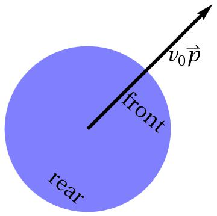
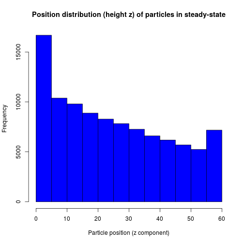
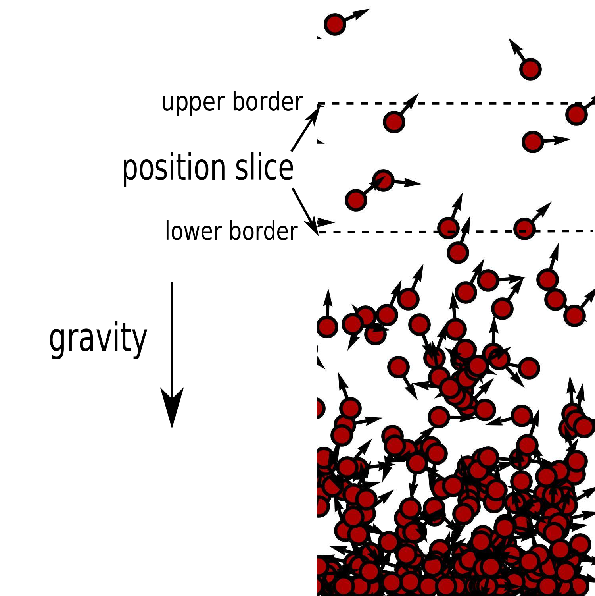
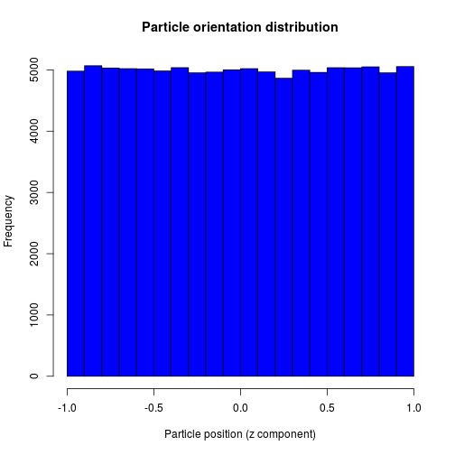
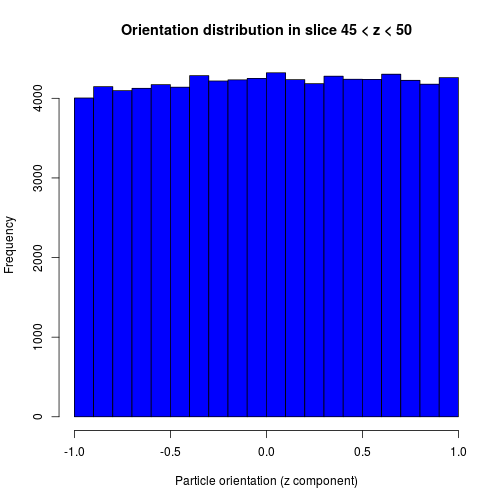
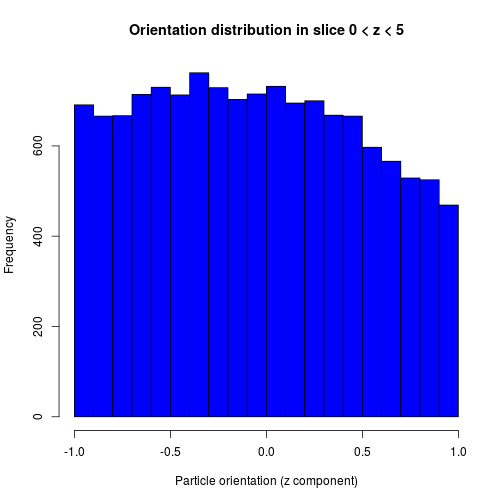

## What are active particles?

- Active particles are micron-sized particles using chemical energy to
  achieve propulsion
- Here, we have a look at self-propelled particles (for simulations this
 just means that they have fixed intrinsic speed $v_0$ but variable orientation
 $\mathbf{p}$)
- Particles could, for example, be microswimmers like bacteria or catalytic
 (and therefore self-propelled) colloids

---&twocol w1:40% w2:60%

## Sedimentation profile

*** =right

 

*** =left

Simulation snapshot of active sedimenting particles

Sedimentation profile is similar to that of passive particles and an effective 
temperature $T_\mathrm{eff}$ depending on particle speed can be defined.

---&twocol w1:40% w2:60%

## Uniform orientation distribution overall

*** =left

 

*** =right

- No aligning force (torque) acting on particles $\hookrightarrow$ overall
    distribution of particles is uniform
    
- $z$-component of orientation is $p_z = \cos(\theta) \in [-1,1]$ where $-1$
    means "swimming down" and $+1$ means "swimming up".

---&twocol w1:30% w2:30%

However, if we restrict our data to certain position slices (see illustration
on p. 3), particles do have preferred swimming directions! 
This is purely a kinetic "sorting" effect without counterpart for equilibrium
systems and passive particles.

*** =left

 

*** =right

 

